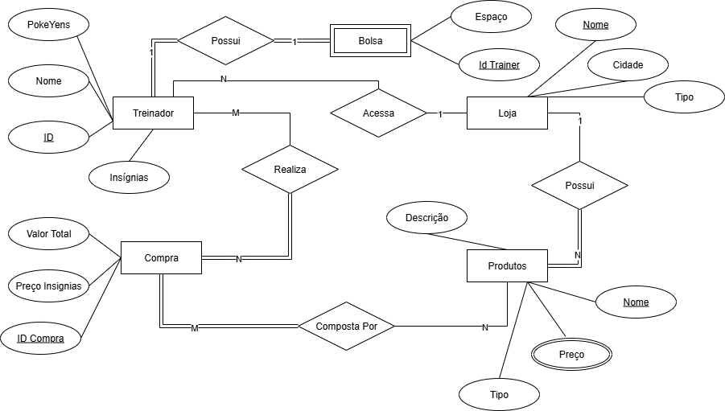

# C07---L2
Projeto de Banco de Dados I - Inatel
# Banco de Dados para Lojas Pokémon

Este projeto consiste no desenvolvimento de um banco de dados relacional voltado para a gestão de **lojas Pokémon**, seus produtos, treinadores, compras e interações.  
O modelo foi elaborado a partir de um diagrama Entidade-Relacionamento (DER) e traduzido para MySQL, incluindo tabelas, chaves primárias e estrangeiras, restrições de integridade, índices, triggers e views de apoio.

## Escopo do Projeto

O banco de dados contempla as seguintes entidades e relacionamentos principais:

- **Treinador**: armazena informações sobre o treinador, como nome, ID, quantidade de PokéYens e número de insígnias.
- **Bolsa**: associada de forma 1:1 ao treinador, representando o espaço de armazenamento que ele possui.
- **Loja**: entidade que representa as lojas Pokémon, com atributos de identificação, cidade e tipo.
- **Produto**: cada produto pertence a uma loja (relação 1:N) e possui atributos como nome, descrição, preço e tipo.
- **Compra**: registra as compras realizadas por treinadores em lojas, incluindo valor total e preço relacionado a insígnias.
- **Compra_Produto**: tabela de ligação M:N entre compras e produtos, contendo quantidade e preço unitário.
- **Acesso_Loja**: registra o acesso de treinadores às lojas, funcionando como um histórico de navegação (relação M:N).

- 

### Principais Regras

- **Treinador – Bolsa**: relação 1:1 (um treinador possui no máximo uma bolsa).
- **Treinador – Compra**: relação 1:N (um treinador pode realizar várias compras).
- **Loja – Produto**: relação 1:N (uma loja possui vários produtos).
- **Compra – Produto**: relação M:N resolvida pela tabela **Compra_Produto**.
- **Treinador – Loja**: relação M:N resolvida pela tabela **Acesso_Loja**.

Além das estruturas básicas, o projeto inclui:

- **Triggers** para manter o valor total das compras atualizado automaticamente.
- **Views** para facilitar consultas, como exibição de itens detalhados de cada compra.
- **Índices** para otimizar buscas por nome, tipo, cidade e datas.

## Desenvolvedora

- **Anna Clara Almeida Pereira**  
- **Matrícula: 9778**
